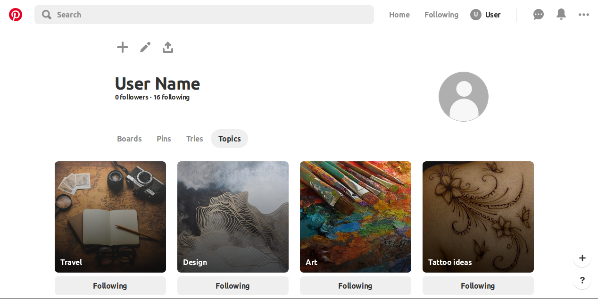

# grid-based-framework
This project is a clone of Pinterest's users page which was built with the grid based framework.

# Live Version

<a href="#"> Pinterest Clone / Live Version</a>

## Screenshot of the Original Version

 

# Built With:

* HTML5
* CSS3

# Authors - click on the links below to see the authors' github.
* <a href="https://github.com/lekegitrepo"> Github: Adeleke Temitayo</a>
* <a href="https://github.com/thsvr"> Github: Thaís Vieira Azevedo</a>